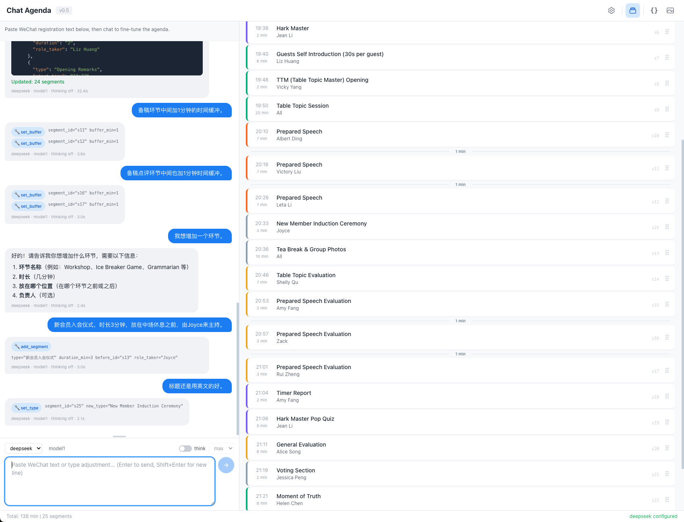

# Chat Agenda

Chat Agenda is a static browser app for generating and editing Toastmasters meeting agendas with LLM tool calling.

You paste raw meeting registration text, the app turns it into a structured agenda, and you can keep refining that agenda through chat or direct manipulation in the UI. The codebase also contains pure helper modules for provider-specific request building, streaming response parsing, and conversation history translation across OpenAI-style, Anthropic, and Gemini APIs.

## Screenshot



## What It Does

- Generates a meeting agenda from WeChat-style registration text.
- Supports fine-grained agenda edits through tool calls such as role swaps, duration changes, segment moves, buffers, and meeting metadata updates.
- Preserves per-message revert points in the UI so a user can roll back to an earlier agenda state.
- Supports multiple providers from the same frontend: DeepSeek, OpenAI, Anthropic, and Gemini.
- Streams assistant output and tool calls into a single chat UI.
- Allows manual segment reordering with drag and drop.
- Exports the current agenda as JSON or PNG.

## Project Shape

This repo is intentionally lightweight. There is no build step and no package manifest.

- [chat-agenda.html](/Users/zerry/Work/Projects/funs/lmm/chat-agenda/chat-agenda.html) is the main application UI and runtime.
- [prompts.js](/Users/zerry/Work/Projects/funs/lmm/chat-agenda/prompts.js) defines the routing and planning prompts plus Toastmasters-specific domain guidance.
- [tools.js](/Users/zerry/Work/Projects/funs/lmm/chat-agenda/tools.js) defines the canonical tool registry and converts it into provider-specific schemas.
- [builders.js](/Users/zerry/Work/Projects/funs/lmm/chat-agenda/builders.js) builds request bodies for different providers and reasoning modes.
- [streaming.js](/Users/zerry/Work/Projects/funs/lmm/chat-agenda/streaming.js) parses SSE streams and reconstructs content, thinking, and tool calls.
- [history.js](/Users/zerry/Work/Projects/funs/lmm/chat-agenda/history.js) converts the app's internal message format into provider-specific chat history.
- [timing.js](/Users/zerry/Work/Projects/funs/lmm/chat-agenda/timing.js) contains the pure rules for shifting a segment earlier or later without violating existing gaps.
- [tests](/Users/zerry/Work/Projects/funs/lmm/chat-agenda/tests) contains Node-based tests for the pure JS modules.
- [vercel.json](/Users/zerry/Work/Projects/funs/lmm/chat-agenda/vercel.json) rewrites `/` to `chat-agenda.html` for deployment.

## Run Locally

Use a static file server from the repo root instead of opening the HTML directly.

```bash
python3 -m http.server 8000
```

Then open:

- `http://localhost:8000/chat-agenda.html`

If you deploy to Vercel, the repo is already configured so `/` serves the app entry page.

## Configure Providers

Open the Settings modal in the app and add an API key for at least one provider.

- Provider settings are stored in browser `localStorage`.
- Each provider has its own base URL, model, thinking toggle, and reasoning effort settings.
- The app enables only providers that have an API key configured.

## Typical Workflow

1. Start the app in a browser.
2. Add an API key in Settings.
3. Paste raw registration text into chat.
4. Let the assistant create the first agenda.
5. Refine it through chat requests like role swaps, duration changes, or inserted segments.
6. Export the result as JSON or PNG when finished.

## Testing

The pure helper modules are covered by Node's built-in test runner.

```bash
node --test tests/*.test.js
```

The current suite covers:

- Tool schema generation in [tools.js](/Users/zerry/Work/Projects/funs/lmm/chat-agenda/tools.js)
- SSE parsing and tool-call reconstruction in [streaming.js](/Users/zerry/Work/Projects/funs/lmm/chat-agenda/streaming.js)
- Provider body builders in [builders.js](/Users/zerry/Work/Projects/funs/lmm/chat-agenda/builders.js)
- Conversation history mapping in [history.js](/Users/zerry/Work/Projects/funs/lmm/chat-agenda/history.js)
- Time-shift conflict rules in [timing.js](/Users/zerry/Work/Projects/funs/lmm/chat-agenda/timing.js)

## Manual Smoke Test

Use the following WeChat-style registration message as an end-to-end UI test fixture for the app.

```plain
@ Allpeople Gather ~ 451st
✈️ ✈️ Theme: Involution or Lying Flat? — Finding a Comfortable Life Balance
Wrap it in or lie flat? Finding a comfortable balance in life
Caught between involution and lying flat—we work hard but feel drained, or rest yet fear falling behind.
How to balance work and life, and live at peace with ourselves?
Balance isn’t just “compromise”—it’s finding your comfortable rhythm.

What we’ll do:
✅ Discussions & Sharing: Two thought-provoking debate topics
✅ Fun Table Topics Session: Surprise spontaneous chats
✅ Member prepared speeches (fresh, personal stories)

If you’re stuck between involution and lying flat—join us, open up, and find your own comfortable life rhythm together!
📅 Date: Apr. 22th, 2026 (Wed) 19: 30 - 21: 30
📍Venue: 809, Area B, Ramet City, Shenzhen
🚇 Transport: Exit B, Baoti Station, Metro Line 1

🍓 open to all
🧀 Open to TMC members only

MM: vicky Yang
#Host
TOM:Jessica
Guests Intro: Liz
TTM: vicky Yang

#Facilitator
SAA: Liz
Club Intro: Lucas
Timer: Amy
Harkmaster: Jean
MOT:Helen Chen

#Prepared Speaker
PS 1: Albert
PS 2: Victory
PS 3: Leta

#Evaluator
IE1: Amy
IE2: Zack
IE3: Rui
TTE: Shelly
GE:Alice Song

[Participants list]

1. Vicky
2. Albert
3. Jean
4. Alice Song
5. Lee Kin-e (Leta)
6. Lucas
7. Victory
8. Rui
9. Amy
10. Liz
11. Shelly
12. Helen Chen
13. Jessica
14. Zack
15.Catherine Yang
```

Suggested chat sequence:

1. Create the first agenda.
   Post the full message above into chat.
   Expected result: the assistant calls `create_meeting` and the UI renders a structured meeting agenda.
2. Add a 1-minute buffer between prepared speeches.
   Example: `Add a 1 min buffer between the prepared speeches.`
   Expected result: the assistant uses one or more `set_buffer` calls so later prepared speeches start later.
3. Add a 1-minute buffer between prepared speech evaluations.
   Example: `Add a 1 min buffer between each prepared speech evaluation.`
   Expected result: the assistant applies buffers before later IE segments rather than inserting fake gap segments.
4. Add a new segment and force confirmation on missing details.
   Example first prompt: `Add a new segment for a lucky draw.`
   Expected result: the assistant should not call `add_segment` yet. It should ask for or recommend missing details such as duration and placement.
   Example confirmation: `Make it a 5 min Lucky Draw after the last prepared speech evaluation, role taker Catherine Yang.`
   Expected result: the assistant calls `add_segment` once the details are clear.
5. Move a segment before or after another segment.
   Example: `Move MOT to after Awards.` or `Move Club Intro before Timer.`
   Expected result: the assistant uses `move_segment`, not a swap tool.
6. Swap two sections.
   Example: `Swap the time slots of TTE and GE.`
   Expected result: the assistant uses `swap_time` and the two sections exchange positions atomically.
7. Directly update a segment's duration, type, or role taker.
   Example duration: `Change Albert's prepared speech to 5 minutes.`
   Example type: `Rename Victory's prepared speech to Ice Breaker.`
   Example role taker: `Change IE3 to Catherine Yang.`
   Expected result: the assistant uses `set_duration`, `set_type`, or `set_role` as appropriate.
8. Shift a segment earlier or later by a concrete number of minutes.
   Example later: `Move Zack's evaluation 2 min later.`
   Example earlier: `Move Rui's evaluation 1 min earlier.`
   Expected result: later moves push that segment and the rest of the agenda later; earlier moves only work when there is enough free gap before the segment, otherwise the assistant should explain the conflict and suggest alternatives.
9. Test start-time changes carefully.
   There is no dedicated segment-level `set_start_time` tool in the current app.
   To test start-time changes, use supported operations that recompute downstream times, such as `move_segment`, `swap_time`, `set_buffer`, `set_duration`, or meeting-level `set_meta(start_time)`.
   Example: `Set the meeting start time to 19:20.` or `Add a 1 min buffer before Zack's evaluation.`

## Notes

- The frontend is browser-first and pulls UI libraries from public CDNs at runtime.
- The helper modules are written as plain scripts so they can be loaded both by the browser app and by Node tests.
- This repo is best understood as a static single-page app plus a small set of provider-interop utilities.
